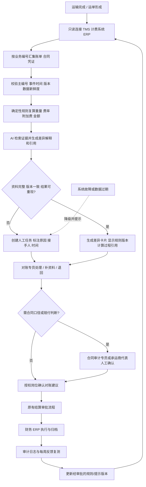

# AI 辅助系统流程图

```mermaid
flowchart TD
  A[运输完成 / 运单形成] --> B[只读连接 TMS 计费系统 ERP]
  B --> C[按业务编号汇集账单 合同 凭证]
  C --> D[校验主编号 事件时间 版本 数据新鲜度]
  D --> E[确定性规则复算重量 费率 附加费 金额]
  E --> F[AI 检索证据并生成差异解释和引用]
  F --> G{资料完整 版本一致 结果可重现?}
  G -- 否 --> H[创建人工任务 标注原因 接手人 时间]
  G -- 是 --> I[生成差异卡片 显示规则版本计算过程引用]
  H --> J[对账专员处理 / 补资料 / 退回]
  I --> J
  J --> K{需合同口径或赔付判断?}
  K -- 是 --> L[合同审计专员或承运商代表人工确认]
  K -- 否 --> M[授权岗位确认对账建议]
  L --> M
  M --> N[原有结算审批流程]
  N --> O[财务 ERP 执行与归档]
  O --> P[审计日志与每周反馈复测]
  P --> Q[更新经审批的规则/提示版本]
  Q --> B
  R[系统故障或数据过期] -. 降级并提示 .-> H
```

AI 仅提供解释和依据定位。模型不认定合同变更、赔付，不批准结算、不付款、不扣费、不覆盖源数据。
