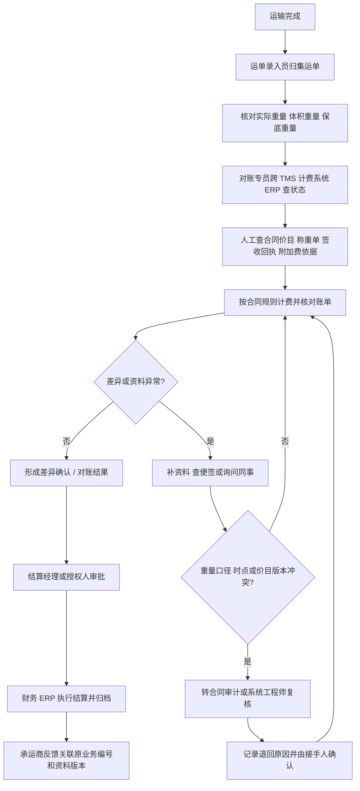

# 现状业务流程图 无 AI

```mermaid
flowchart TD
  A[运输完成] --> B[运单录入员归集运单]
  B --> C[核对实际重量 体积重量 保底重量]
  C --> D[对账专员跨 TMS 计费系统 ERP 查状态]
  D --> E[人工查合同价目 称重单 签收回执 附加费依据]
  E --> F[按合同规则计费并核对账单]
  F --> G{差异或资料异常?}
  G -- 否 --> J[形成差异确认 / 对账结果]
  G -- 是 --> H[补资料 查便签或询问同事]
  H --> I{重量口径 时点或价目版本冲突?}
  I -- 是 --> K[转合同审计或系统工程师复核]
  I -- 否 --> F
  K --> L[记录退回原因并由接手人确认]
  L --> F
  J --> M[结算经理或授权人审批]
  M --> N[财务 ERP 执行结算并归档]
  N --> O[承运商反馈关联原业务编号和资料版本]
```

流程主链来自访谈记录；系统查询和异常细节为待现场核实的流程归纳。
